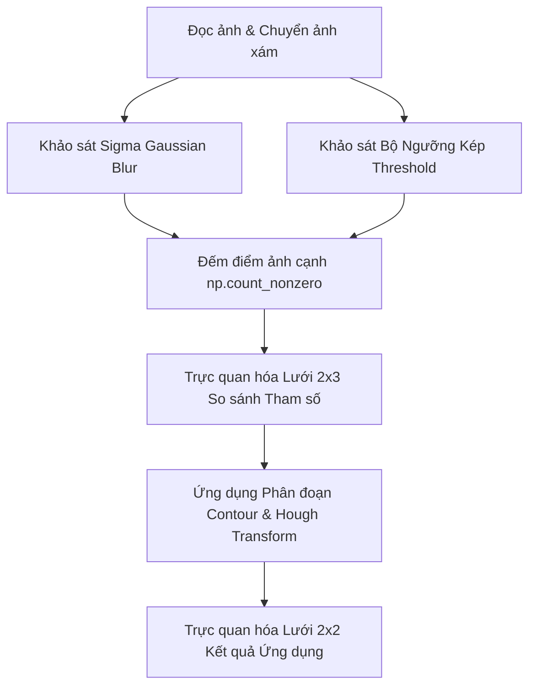

# KẾ HOẠCH THỰC HIỆN - PHẦN II.1 & II.2 (OPENCV CANNY)
**Thành viên thực hiện:** Duy (Thành viên 4)  
**Tệp mã nguồn chính:** `notebook/4.py`  

---

## 1. Cấu trúc Luồng Xử lý trong `notebook/4.py`

Kế hoạch được tối ưu bám sát mã nguồn mới của Duy, kết hợp giữa khảo sát tham số định tính/định lượng và ứng dụng phân đoạn / nhận dạng hình học.

---

## 2. Chi tiết các Bước Thực hiện

### Bước 1: Khảo sát Tham số Sigma (Gaussian Blur trước Canny)
- Làm mờ ảnh với bộ lọc Gaussian Kernel $(5\times 5)$ và các mức `sigma = 1, 2, 5`.
- Trích xuất cạnh bằng `cv2.Canny(blur, 100, 200)`.
- **Thống kê định lượng**: Sử dụng `np.count_nonzero()` để đếm chính xác số pixel cạnh thu được ở từng mức Sigma.

### Bước 2: Khảo sát Bộ Ngưỡng Kép (Threshold Low / High)
- Sử dụng ảnh đã làm mờ (`sigma = 2`), áp dụng `cv2.Canny` với 3 bộ ngưỡng:
  - `50 - 150`: Ngưỡng thấp, nhạy cạnh, phát hiện nhiều nét chi tiết và nhiễu.
  - `100 - 200`: Ngưỡng mặc định OpenCV, kết quả cân bằng.
  - `150 - 300`: Ngưỡng cao, chỉ giữ cạnh mạnh, loại bỏ nhiễu và đứt chi tiết mảnh.
- **Thống kê định lượng**: Đếm số lượng pixel cạnh `np.count_nonzero()` cho từng bộ ngưỡng.

### Bước 3: Trực quan hóa So sánh Tham số (Lưới 2x3)
- Sử dụng `matplotlib.pyplot` tạo lưới 2 hàng x 3 cột:
  - Hàng 1: Đồ thị kết quả Canny theo `Sigma = 1`, `Sigma = 2`, `Sigma = 5`.
  - Hàng 2: Đồ thị kết quả Canny theo các bộ ngưỡng `50-150`, `100-200`, `150-300`.

### Bước 4: Mở rộng Ứng dụng Phân đoạn & Nhận dạng (Lưới 2x2)
- **Phân đoạn Contour**:
  - Dùng `cv2.findContours` tìm đường biên từ `canny_edges`.
  - Lọc contour diện tích $> 50$ và vẽ Bounding Box màu đỏ (`cv2.boundingRect`).
- **Nhận dạng Hough Transform**:
  - Phát hiện đoạn thẳng bằng `cv2.HoughLinesP`.
  - Phát hiện đường tròn bằng `cv2.HoughCircles`.
- **Hiển thị Lưới 2x2**: Ảnh gốc, Ảnh cạnh Canny, Phân đoạn Contour, Nhận dạng Hough.

---

## 3. Thư viện & Công cụ Sử dụng
- **`cv2`**: Chuyển màu, GaussianBlur, Canny, findContours, HoughLinesP, HoughCircles.
- **`numpy`**: Đếm pixel nhị phân `np.count_nonzero()`, xử lý mảng.
- **`matplotlib.pyplot`**: Trực quan hóa hình ảnh đa lưới (Subplots).