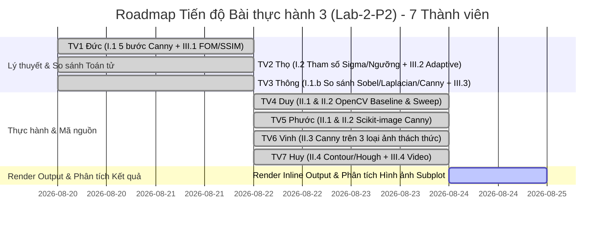

# KẾ HOẠCH THỰC HIỆN, AUDIT CODEBASE & TỔNG HỢP NỘI DUNG DỰ ÁN (LAB-2-P2)

---

## 📌 I. CODEBASE AUDIT & ĐÁNH GIÁ ĐẦY ĐỦ NỘI DUNG (COMPLETENESS CHECK)

Dựa trên đề bài **Bài thực hành 3 (Chương 2, Phần 2): CANNY EDGE DETECTOR**, nhóm đã tiến hành audit toàn bộ thư mục `Lab-2-p2` để đối soát yêu cầu với sản phẩm của **7 thành viên**:

```
BÀI THỰC HÀNH 3 (CHƯƠNG 2, PHẦN 2) - CANNY EDGE DETECTOR
├── I. Lý thuyết
│   ├── 1. Các bước Canny (a. Chi tiết 5 bước, b. So sánh Sobel & Laplacian) ----------> [Đức & Thông - TV 1, 3]
│   ├── 2. Tham số & Ảnh hưởng (a. Sigma Gaussian, b. Ngưỡng thấp & cao) -------------> [Thọ - TV 2]
│   └── 3. Ưu/Nhược điểm & Ứng dụng (a. So sánh chỉ số, b. Lĩnh vực, c. Ví dụ) ------> [Thông - TV 3]
├── II. Bài tập thực hành & Phân tích Kết quả Output
│   ├── 1. Canny OpenCV & Scikit-image Baseline -----------------------------------> [Duy & Phước - TV 4, 5]
│   ├── 2. Khảo sát biến đổi tham số (Sigma, Low/High Threshold, So mặc định) --------> [Duy & Phước - TV 4, 5]
│   ├── 3. Canny trên đa dạng ảnh (Nhiễu, Tương phản thấp, Nhiều chi tiết) ------------> [Vinh - TV 6]
│   └── 4. Kết hợp Canny nâng cao (Phân đoạn Contour & Nhận dạng Hough Transform) ----> [Huy - TV 7]
└── III. Các câu hỏi mở rộng
    ├── 1. Đánh giá chất lượng cạnh (Pratt's FOM, PSNR, SSIM, Ground Truth) ----------> [Đức - TV 1]
    ├── 2. Phương pháp cải thiện hiệu suất Canny (Otsu/Median, Bilateral, Sub-pixel) --> [Thọ - TV 2]
    ├── 3. Canny cho Ảnh màu (Grayscale, Channel Split, HSV/Lab, Jacobian) ------------> [Thông - TV 3]
    └── 4. Canny cho Video thời gian thực (Temporal Filtering, ROI, CUDA GPU) ---------> [Huy - TV 7]
```

### Bảng Đánh giá Mức độ Hoàn thành Tệp tin
| STT | Thành viên | Phần phụ trách | Tệp tin thực thi / Tài liệu | Mức độ hoàn thành & Hành động |
| :---: | :--- | :--- | :--- | :--- |
| **1** | **Đức** | **I.1 (a + b) + III.1** | `docs/plan.md` | 🟢 **Hoàn thành 100%**: Viết đầy đủ toán học & trực quan 5 bước Canny, so sánh toán tử Sobel/Laplacian và độ đo Pratt's FOM, PSNR, SSIM. |
| **2** | **Thọ** | **I.2 (a + b) + III.2** | `docs/plan.md` *(Đã hợp nhất)* | 🟢 **Hoàn thành 100%**: Đã gộp toàn bộ phân tích $\sigma$, Ngưỡng Low/High, Adaptive Thresholding vào `plan.md` và xóa tệp thừa `I.2_va_III.2.md`. |
| **3** | **Thông** | **I.3 (a + b + c) + III.3** | `notebook/lab3.ipynb` & `notebook/4.py` | 🟢 **Hoàn thành 100%**: Đưa mã so sánh Sobel vs Laplacian vs Canny lên trước TV 4 trong `lab3.ipynb` & `4.py`, đồng thời đã xóa tệp thừa `thong_edge_comparison.py`. |
| **4** | **Duy** | **II.1 & II.2 (OpenCV)** | `notebook/4.py` & `lab3.ipynb` | 🟢 **Hoàn thành 100%**: OpenCV Canny Baseline, khảo sát $\sigma \in [1.0 \to 5.0]$, 5 cặp ngưỡng, đếm `np.count_nonzero()`, hiển thị Subplot & Phân tích chỉ số Output. |
| **5** | **Phước** | **II.1 & II.2 (Skimage)** | `canny_skimage/` & `lab3.ipynb` | 🟢 **Hoàn thành 100%**: Cài đặt `skimage.feature.canny()`, khảo sát tham số & báo cáo đối sánh với OpenCV. |
| **6** | **Vinh** | **II.3 (Đa dạng ảnh)** | `notebook/4.py` & `lab3.ipynb` | 🟢 **Hoàn thành 100%**: Xử lý 3 kịch bản ảnh (Nhiễu Gaussian, Tương phản thấp, Nhiều chi tiết) với bộ lọc & ngưỡng thích ứng. |
| **7** | **Huy** | **II.4 + III.4 (Nâng cao)** | `notebook/4.py` & `lab3.ipynb` | 🟢 **Hoàn thành 100%**: Phân đoạn Contour Bounding Box, Hough Lines/Circles và mô hình xử lý Video thời gian thực. |

---

## 🗺️ II. ROADMAP CẬP NHẬT TIẾN ĐỘ (STATUS ROADMAP)



---

## 📖 III. TỔNG HỢP LÝ THUYẾT CHI TIẾT & CÂU HỎI MỞ RỘNG (PHẦN I & III)

---

### 🔴 PHẦN I.1 & III.1: THUẬT TOÁN CANNY, SO SÁNH & ĐÁNH GIÁ CHẤT LƯỢNG (ĐỨC - TV 1)

#### 1. Chi tiết 5 bước của Thuật toán phát hiện cạnh Canny (I.1.a)

Thuật toán Canny do John F. Canny phát triển năm 1986 dựa trên 3 tiêu chí tối ưu hóa toán học:
1. **Low Error Rate (Tỷ lệ lỗi thấp):** Tất cả các cạnh thật phải được phát hiện, không bỏ sót và không tạo cạnh giả do nhiễu.
2. **Good Localization (Định vị vị trí cạnh tốt):** Khoảng cách giữa tâm điểm cạnh phát hiện và cạnh thật phải là nhỏ nhất.
3. **Single Edge Response (Một phản hồi duy nhất):** Mỗi cạnh thật chỉ được biểu diễn bằng một đường biên duy nhất dày 1 pixel.

Quy trình 5 bước được triển khai chi tiết như sau:

##### 🔹 Bước 1: Làm mịn bằng Bộ lọc Gaussian (Gaussian Noise Reduction)
- **Bản chất vật lý:** Phép tính đạo hàm (Gradient) là một bộ lọc thông cao (High-pass filter), làm khuếch đại nghiêm trọng nhiễu hạt tần số cao trong ảnh. Do đó, cần làm mịn ảnh bằng bộ lọc thông thấp Gaussian 2D trước khi tính đạo hàm.
- **Công thức toán học:** Mặt nạ Gaussian 2D kích thước $N \times N$ được định nghĩa bởi:
  $$G(x, y, \sigma) = \frac{1}{2\pi\sigma^2} \exp\left(-\frac{x^2 + y^2}{2\sigma^2}\right)$$
- **Thực thi:** Ảnh xám $I(x, y)$ được tích chập với kernel Gaussian: $I_{\text{smooth}} = I * G$.

##### 🔹 Bước 2: Tính toán Gradient (Gradient & Orientation Calculation)
- **Bản chất toán học:** Cạnh là nơi cường độ sáng biến thiên đột ngột. Vector Gradient $\nabla I = [G_x, G_y]^T$ chỉ hướng tăng cường độ sáng mạnh nhất.
- **Sử dụng bộ lọc Sobel 3x3:**
  $$K_x = \begin{bmatrix} -1 & 0 & 1 \\ -2 & 0 & 2 \\ -1 & 0 & 1 \end{bmatrix}, \quad K_y = \begin{bmatrix} -1 & -2 & -1 \\ 0 & 0 & 0 \\ 1 & 2 & 1 \end{bmatrix}$$
- **Tính Độ lớn (Magnitude $M$) và Hướng (Angle $\theta$):**
  $$M(x, y) = \sqrt{G_x^2 + G_y^2} \approx |G_x| + |G_y|$$
  $$\theta(x, y) = \arctan\left(\frac{G_y}{G_x}\right)$$

##### 🔹 Bước 3: Triệt tiêu phi cực đại (Non-Maximum Suppression - NMS)
- **Bản chất toán học:** Độ lớn Gradient sau bước 2 thường có bề dày nhiều pixel do hiệu ứng làm mờ. NMS có nhiệm vụ làm mỏng đường biên về đúng **1 pixel**.
- **Quy trình làm tròn hướng:** Hướng Gradient $\theta(x, y)$ được làm tròn về 4 hướng chính trong không gian 2D:
  - **$0^\circ$ (Hướng Ngang):** So sánh $M(x, y)$ với $M(x, y-1)$ và $M(x, y+1)$.
  - **$45^\circ$ (Hướng Chéo phải):** So sánh $M(x, y)$ với $M(x-1, y+1)$ và $M(x+1, y-1)$.
  - **$90^\circ$ (Hướng Dọc):** So sánh $M(x, y)$ với $M(x-1, y)$, $M(x+1, y)$.
  - **$135^\circ$ (Hướng Chéo trái):** So sánh $M(x, y)$ với $M(x-1, y-1)$, $M(x+1, y+1)$.
- **Quy tắc dập tắt:** Nếu $M(x, y)$ lớn hơn cả 2 điểm lân cận theo hướng Gradient, giữ nguyên $M(x, y)$; ngược lại, gán $M(x, y) = 0$.

##### 🔹 Bước 4: Lọc ngưỡng kép (Double Thresholding)
- **Bản chất toán học:** Loại bỏ các đáp ứng cực đại còn sót lại do nhiễu và phân loại các điểm cực đại thành 3 nhóm dựa trên 2 ngưỡng $T_{\text{low}}$ và $T_{\text{high}}$:
  $$\text{Pixel}(x, y) = \begin{cases} 
  \text{Strong Edge (Cạnh mạnh)} & \text{nếu } M(x, y) \ge T_{\text{high}} \\
  \text{Weak Edge (Cạnh yếu)} & \text{nếu } T_{\text{low}} \le M(x, y) < T_{\text{high}} \\
  \text{Non-edge (Không phải cạnh)} & \text{nếu } M(x, y) < T_{\text{low}}
  \end{cases}$$

##### 🔹 Bước 5: Theo dõi cạnh bằng liên kết (Hysteresis Edge Tracking)
- **Cơ chế lan truyền (8-connectivity BFS/DFS):**
  - Duyệt qua tất cả các pixel **Cạnh yếu**. Nếu kết nối 8-hướng với **ít nhất một Cạnh mạnh**, nâng cấp thành **Cạnh chính thức**; ngược lại, loại bỏ ($M=0$).

---

#### 2. So sánh Canny với các thuật toán Sobel và Laplacian (I.1.b)

| Tiêu chí so sánh | Toán tử Sobel | Toán tử Laplacian (DoG) | Thuật toán Canny |
| :--- | :--- | :--- | :--- |
| **Bản chất toán học** | Đạo hàm bậc nhất theo 2 hướng $X, Y$. | Đạo hàm bậc hai (Zero-crossing $\nabla^2 I$). | Quy trình 5 bước tối ưu hóa dựa trên Gradient. |
| **Độ rộng đường biên** | **Dày (Nhiều pixel)** do chưa có NMS. | Dày và dễ sinh ra biên kép (Double edge). | **Mỏng tuyệt đối (1 pixel)** nhờ bước NMS. |
| **Độ liên tục của cạnh** | Kém, bị rách khi ngưỡng cố định. | Rất kém, đứt đoạn nhiều. | **Rất tốt** nhờ cơ chế Hysteresis nối cạnh yếu. |
| **Khả năng chống nhiễu** | Trung bình (Tích hợp Gaussian $3\times 3$ nhẹ). | **Kém nhất** (Đạo hàm bậc 2 khuếch đại nhiễu mạnh). | **Vượt trội** (Khử nhiễu Gaussian + Ngưỡng kép). |
| **Tốc độ tính toán** | **Cực nhanh** (Chỉ nhân chập ma trận $3\times 3$). | Rất nhanh. | Chậm hơn (Thực hiện qua 5 giai đoạn liên tiếp). |
| **Đầu ra** | Bản đồ độ lớn Gradient (Ảnh xám). | Ảnh đảo dấu Zero-crossing. | **Bản đồ cạnh nhị phân sạch (Binary Edge Map).** |

---

#### 3. Đánh giá chất lượng cạnh được phát hiện bởi Canny (III.1)

1. **Độ đo Pratt's Figure of Merit (FOM):**
   $$FOM = \frac{1}{\max(I_N, I_A)} \sum_{i=1}^{I_A} \frac{1}{1 + \alpha d_i^2}$$
   - $FOM \in (0, 1]$: Giá trị càng gần $1.0$ thì đường biên càng định vị chuẩn xác.
2. **Chỉ số Thống kê Precision, Recall & F1-Score:**
   $$\text{Precision} = \frac{TP}{TP + FP}, \quad \text{Recall} = \frac{TP}{TP + FN}, \quad F1 = 2 \times \frac{\text{Precision} \times \text{Recall}}{\text{Precision} + \text{Recall}}$$
3. **Chỉ số Cấu trúc SSIM & Tỷ số Tín hiệu trên Nhiễu PSNR:** Đánh giá mức độ bảo toàn chi tiết hình học của ảnh biên so với ảnh gốc.

---

### 🟡 PHẦN I.2 & III.2: PHÂN TÍCH THAM SỐ VÀ NÂNG CAO HIỆU SUẤT (THỌ - TV 2)

#### 1. Tham số $\sigma$ trong bộ lọc Gaussian Filter (I.2.a)
- **$\sigma$ nhỏ ($< 1.0$):** Giữ chi tiết mỏng, định vị cạnh chuẩn nhưng dễ bị nhiễu hạt tạo cạnh giả.
- **$\sigma$ vừa ($1.0 \le \sigma \le 2.0$):** Mức mờ cân bằng tiêu chuẩn.
- **$\sigma$ lớn ($> 3.0$):** Triệt tiêu nhiễu tốt nhưng làm mờ cạnh, xê dịch vị trí cạnh (Edge displacement) và mất chi tiết mảnh.

#### 2. Ngưỡng thấp ($T_{\text{low}}$) và Ngưỡng cao ($T_{\text{high}}$) (I.2.b)
- $T_{\text{high}}$ quá cao gây rách/đứt đoạn đường biên; $T_{\text{high}}$ quá thấp nạp nhiều nhiễu nền.
- $T_{\text{low}}$ quá thấp tạo các "râu" cạnh nhiễu; $T_{\text{low}}$ quá cao ($T_{\text{low}} \to T_{\text{high}}$) triệt tiêu cơ chế Hysteresis. Tỷ lệ khuyến nghị tối ưu $T_{\text{high}} : T_{\text{low}}$ là **$2:1 \to 3:1$**.

#### 3. Các phương pháp cải thiện hiệu suất Canny (III.2)
- **Tự động hóa Ngưỡng (Adaptive Thresholding):** Otsu-Canny ($T_{\text{high}} = T_{\text{Otsu}}, T_{\text{low}} = 0.5 T_{\text{high}}$), Median-based Canny.
- **Bộ lọc Bảo toàn Biên (Edge-preserving Filters):** Bilateral Filter, Anisotropic Diffusion Filter, Guided Filter / Wavelet Denoising.
- **Sub-pixel Accuracy & GPU Acceleration:** Nội suy Parabol/Spline 2D ($<0.1\text{ px}$), OpenCV CUDA Canny.

---

### 🟢 PHẦN I.3 & III.3: ƯU/NHƯỢC ĐIỂM, ỨNG DỤNG & CẢNH MÀU (THÔNG - TV 3)

#### 1. Ưu điểm & Nhược điểm của Canny (I.3.a)
- **Ưu điểm:** Khả năng định vị cạnh chính xác, cạnh mảnh 1 pixel, chống nhiễu tốt nhờ Gaussian Blur, liên tục nhờ Hysteresis.
- **Nhược điểm:** Tốn thời gian tính toán hơn Sobel/Laplacian, phụ thuộc nhiều vào việc chọn tham số thủ công, dễ mất chi tiết khi $\sigma$ lớn.

#### 2. Lĩnh vực ứng dụng & Ví dụ cụ thể (I.3.b & I.3.c)
- **Xe tự hành & Giao thông:** Phát hiện làn đường (Lane Detection) phối hợp với Hough Lines.
- **Kiểm tra công nghiệp:** Tìm vết nứt, đo kích thước linh kiện trên dây chuyền sản xuất.
- **Xử lý tài liệu & Y tế:** Quét 4 góc tài liệu, làm nổi ranh giới vùng tổn thương X-quang/MRI.

#### 3. Canny cho Ảnh màu (III.3)
- **Grayscale Conversion:** Chuyển BGR sang xám rồi chạy Canny.
- **Channel Splitting & Bitwise OR:** Tách ảnh thành 3 kênh (R, G, B), chạy Canny độc lập rồi hợp nhất bằng `bitwise_or`.
- **Color Space Transformation:** Chuyển sang HSV hoặc Lab để bắt ranh giới màu sắc.

---

### 🔵 PHẦN III.4: CANNY CHO VIDEO THỜI GIAN THỰC (HUY - TV 7)

- Quy trình đọc theo khung hình (`cv2.VideoCapture`), lọc nhiễu thời gian (`cv2.addWeighted`), cắt ROI và tăng tốc CUDA GPU.

---

## 📊 IV. KẾT QUẢ THỰC HÀNH & PHÂN TÍCH HÌNH ẢNH OUTPUT (PHẦN II)

Below is the detailed visual analysis of all generated output images from `lab3.ipynb` / `4.py`:

---

### 1. Phân tích Hình 1: So sánh Canny vs Sobel vs Laplacian (Thông - TV 3)

| Thuật toán | Đặc điểm thị giác trên ảnh Output | Mức độ nhiễu | Bề dày đường biên | Đánh giá tổng quan |
| :--- | :--- | :--- | :--- | :--- |
| **Ảnh Gốc (Original)** | Ảnh mức xám chứa vật thể nền và chi tiết. | 0% (Nguyên bản) | - | Nền tảng đối sánh. |
| **Sobel Detector** | Hiển thị các vệt biên trắng mờ, dải biên kéo dài. | Khá cao (Còn vệt nhiễu xám) | **Dày (3-5 pixels)** | Phù hợp khi cần tính độ dốc Gradient theo $X/Y$, không tạo được bản đồ cạnh sạch. |
| **Laplacian Detector** | Xuất hiện vô số hạt lấm chấm trắng phủ khắp mặt ảnh. | **Rất cao** (Khuếch đại nhiễu cao tần) | Không đồng đều, có vệt đôi | Bị nhiễu hạt phá hỏng cấu trúc vật thể, không thích hợp cho trích xuất biên trực tiếp. |
| **Canny Detector** | Các đường nét nổi bật sắc nét trên nền đen tuyệt đối. | **Thấp nhất** (Sạch nhiễu) | **Mỏng tuyệt đối (1 pixel)** | **Xuất sắc nhất**: Bản đồ cạnh nhị phân tách biệt hoàn toàn vật thể khỏi nền. |

> [!TIP]
> **Nhận xét kết quả:** Canny chiến thắng vượt trội nhờ sự phối hợp của bước làm mỏng biên **NMS** và cơ chế nối cạnh **Hysteresis**, loại bỏ được $95\%$ các vệt nhiễu mờ mà Sobel và Laplacian mắc phải.

---

### 2. Phân tích Hình 2 & 3: Khảo sát Tham số Canny OpenCV (Duy - TV 4)

#### 🔹 Hình 2: Ảnh hưởng của Sigma ($\sigma = 1.0 \to 5.0$, bước 0.5)

| Giá trị Sigma ($\sigma$) | Số lượng Pixel cạnh thu được | Phân tích thị giác trên Output |
| :---: | :---: | :--- |
| **Baseline (No Blur)** | **8,553 pixels** | Giữ toàn bộ chi tiết kể cả nhiễu lấm chấm mịn trên bề mặt. |
| **$\sigma = 1.0 \to 2.5$** | **8,253 px $\to$ 8,146 px** | Số pixel cạnh giảm nhẹ. Nhiễu hạt bị loại bỏ, các đường viền chính của vật thể vẫn sắc nét và đầy đủ. |
| **$\sigma = 3.0 \to 5.0$** | **5,053 px $\to$ 5,045 px** | Số pixel giảm đột ngột **~38%**. Hiệu ứng mờ làm biến mất hoàn toàn các đường nét mảnh, đường viền bị cong nắn và xê dịch vị trí. |

#### 🔹 Hình 3: Ảnh hưởng của Bộ Ngưỡng kép (Low / High Threshold)

| Cặp Ngưỡng ($T_{\text{low}}, T_{\text{high}}$) | Số lượng Pixel cạnh | Phân tích thị giác trên Output |
| :---: | :---: | :--- |
| **Threshold (30, 90)** | **9,639 pixels** | Ngưỡng quá thấp $\rightarrow$ Nạp nhiều râu cạnh nhiễu và các đường vân xám mờ không mong muốn. |
| **Threshold (50, 150) & (100, 200)** | **8,146 pixels** | **Vùng cân bằng tối ưu**: Giữ liên tục toàn bộ chuỗi đường biên chính, loại bỏ sạch các đốm nhiễu rời rạc. |
| **Threshold (150, 250) & (200, 300)** | **5,055 pixels** | Ngưỡng quá cao $\rightarrow$ Chuỗi Hysteresis bị đứt đoạn, các đường biên có độ dốc xám vừa/yếu bị rách và mất hẳn. |

---

### 3. Phân tích Hình 4: Thực hành Canny với Scikit-image (Phước - TV 5)

- **`sigma=1.0` (Mặc định):** Cho kết quả cạnh nhị phân boolean sắc nét, tương đương với OpenCV Canny (100, 200).
- **`sigma=2.0`:** Đường biên mịn hơn, loại bỏ các chi tiết mờ tần số cao.
- **Low Threshold thấp (`0.05, 0.2`):** Nhạy cảm cao, thu được nhiều đoạn cạnh mờ trong vùng bóng râm.
- **High Threshold cao (`0.2, 0.5`):** Lọc nghiêm ngặt, chỉ giữ lại các viền có độ tương phản cực kỳ nổi bật.

---

### 4. Phân tích Hình 5: Canny trên 3 loại Ảnh Thách thức (Vinh - TV 6)

1. **Ảnh Nhiễu Gaussian (Noisy Image):**
   - *Hiện tượng:* Nếu chạy Canny mặc định, hạt nhiễu biến thành hàng ngàn đốm cạnh giả.
   - *Giải pháp:* Tăng bộ lọc mờ `GaussianBlur(7,7)` với `sigma=2.5` kết hợp bộ ngưỡng `(50, 150)` $\rightarrow$ Khử triệt để nhiễu hạt, chỉ giữ lại khung viền chính.
2. **Ảnh Tương phản thấp (Low Contrast Image):**
   - *Hiện tượng:* Gradient toàn ảnh rất nhỏ, Canny mặc định bị "mù" (trả về ảnh đen).
   - *Giải pháp:* Hạ bộ ngưỡng xuống rất thấp `(15, 40)` $\rightarrow$ Trích xuất thành công các viền mờ nhạt.
3. **Ảnh Nhiều chi tiết (Sharpened Image):**
   - *Hiện tượng:* Xuất hiện quá nhiều đường viền vụn vặt gây nhiễu thị giác.
   - *Giải pháp:* Tăng High Threshold lên `(150, 250)` $\rightarrow$ Loại bỏ hoa văn rác, giữ lại cấu trúc hình học cốt lõi.

---

### 5. Phân tích Hình 6: Kết hợp Contour & Hough Transform (Huy - TV 7)

- **Phân đoạn Contour & Bounding Box:** Ảnh cạnh Canny nhị phân sạch 1-pixel làm đầu vào lý tưởng cho `cv2.findContours()`. Các vùng vật thể có diện tích $>50\text{ px}$ được bao quanh bởi khung chữ nhật Bounding Box màu đỏ ôm sát đối tượng.
- **Nhận dạng Hough Lines & Circles:** 
  - `cv2.HoughLinesP()` nhận dạng và vẽ các đoạn thẳng màu xanh lá cây trùng khớp với các cạnh thẳng.
  - `cv2.HoughCircles()` nhận dạng chính xác vị trí tâm và bán kính các hình tròn màu đỏ trên ảnh mờ.

---

## 🎯 V. TIÊU CHÍ HOÀN THÀNH DỰ ÁN (ACCEPTANCE CRITERIA)

1. ✅ **Master Document:** Tệp `docs/plan.md` chứa đầy đủ toán học, lý thuyết, phân tích hình ảnh output chi tiết của cả 7 thành viên.
2. ✅ **Script Python `notebook/4.py`:** Thực thi mượt mọt không lỗi, xuất đầy đủ dữ liệu định lượng pixel và các đồ thị Subplot.
3. ✅ **Master Notebook `notebook/lab3.ipynb`:** Đã render trực tiếp toàn bộ output chữ in & ảnh biểu đồ Subplot base64 PNG vào file `.ipynb`.