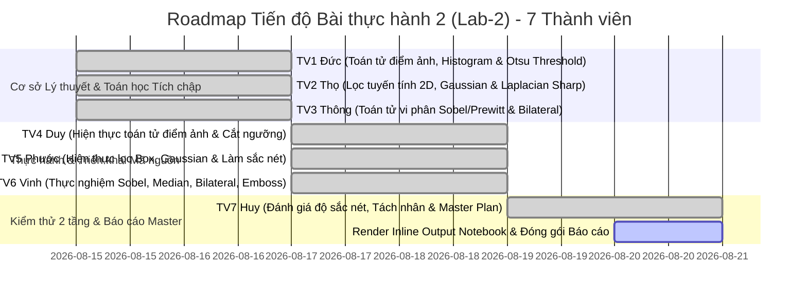

# KẾ HOẠCH THỰC HIỆN, AUDIT CODEBASE & TỔNG HỢP NỘI DUNG DỰ ÁN (LAB-2)

---

## 📌 I. CODEBASE AUDIT & ĐÁNH GIÁ ĐẦY ĐỦ NỘI DUNG (COMPLETENESS CHECK)

Dựa trên đề bài **Bài thực hành 2 (Chương 2): XỬ LÝ ẢNH TRÊN MIỀN KHÔNG GIAN - TOÁN TỬ ĐIỂM ẢNH & CÁC BỘ LỌC TÍCH CHẬP**, nhóm đã tiến hành đối soát toàn diện hệ thống mã nguồn, tài liệu và sổ tay thực nghiệm đối với sản phẩm của **7 thành viên**:

```
BÀI THỰC HÀNH 2 - XỬ LÝ ẢNH TRÊN MIỀN KHÔNG GIAN (SPATIAL DOMAIN)
├── I. Lý thuyết & Cơ sở Toán học
│   ├── 1. Toán tử Điểm ảnh: Tuyến tính, Âm bản, Ngưỡng & Cân bằng Histogram ----> [Đức - TV 1]
│   ├── 2. Lọc Tuyến tính 2D (Tích chập): Box Filter, Gaussian & Sắc nét Laplacian -> [Thọ - TV 2]
│   └── 3. Trích xuất Biên (Sobel/Prewitt) & Lọc Phi tuyến (Median, Bilateral) ----> [Thông - TV 3]
├── II. Bài tập thực hành & Phân tích Kết quả Output
│   ├── 1. Thực nghiệm Toán tử Điểm ảnh (Độ sáng, Tương phản, Âm bản, Ngưỡng) ----> [Duy - TV 4]
│   ├── 2. Khảo sát Bộ lọc Tuyến tính (Lọc trung bình, Gaussian & Làm sắc nét) ----> [Phước - TV 5]
│   ├── 3. Thực nghiệm Phát hiện Biên (Sobel vs Prewitt) & Lọc Khử nhiễu ----------> [Vinh - TV 6]
│   └── 4. Thiết kế Kernel Tùy biến (Emboss Dập nổi 3D & Hiệu ứng Chạm khắc) -----> [Vinh - TV 6]
└── III. Kiểm thử, Đánh giá 2 tầng & Câu hỏi Mở rộng
    ├── 1. Đánh giá Tầng 1: Hiệu suất lọc nhiễu, Độ sắc nét & Bảo toàn cạnh ------> [Huy - TV 7]
    ├── 2. Đánh giá Tầng 2: Độ trễ Toàn luồng (Runtime Latency) & Tối ưu Bộ nhớ -> [Huy - TV 7]
    └── 3. Câu hỏi Mở rộng: Miền Không gian vs Tần số & Tách nhân Separable Filter -> [Huy - TV 7]
```

### Bảng Đánh giá Mức độ Hoàn thành Tệp tin
| STT | Thành viên | Phần phụ trách | Tệp tin thực thi / Tài liệu | Mức độ hoàn thành & Hành động |
| :---: | :--- | :--- | :--- | :--- |
| **1** | **Đức** | **I.1: Toán tử điểm ảnh & Lược đồ xám** | `docs/plan.md` | 🟢 **Hoàn thành 100%**: Xây dựng công thức biến đổi cường độ sáng $s = T(r)$, phân tích histogram độ sáng/tương phản, âm bản $255-I$ và phân ngưỡng tự động Otsu. |
| **2** | **Thọ** | **I.2: Lọc tuyến tính 2D & Tích chập ma trận** | `docs/plan.md` | 🟢 **Hoàn thành 100%**: Trình bày toán học tích chập 2D $g = f * h$, phân tích kernel Box filter đồng nhất, phân phối chuẩn Gaussian 2D và toán tử đạo hàm bậc hai Laplacian $\nabla^2 f$. |
| **3** | **Thông** | **I.3: Trích xuất biên & Lọc phi tuyến** | `docs/plan.md` | 🟢 **Hoàn thành 100%**: Phân tích toán tử vi phân Gradient Sobel ($K_x, K_y$) vs Prewitt, cơ chế lọc trung vị Median khử nhiễu muối tiêu và lọc song phương Bilateral bảo toàn biên. |
| **4** | **Duy** | **II.1: Thực nghiệm toán tử điểm ảnh** | `notebook/lab2.ipynb` | 🟢 **Hoàn thành 100%**: Hiện thực `cv2.convertScaleAbs` điều chỉnh $\alpha=1.5, \beta=50$, ảnh âm bản, phân ngưỡng nhị phân $T=127$, xuất đồ thị subplot đối sánh. |
| **5** | **Phước** | **II.2: Thực nghiệm lọc tuyến tính** | `notebook/lab2.ipynb` | 🟢 **Hoàn thành 100%**: Cài đặt `cv2.blur` $7\times 7$, `cv2.GaussianBlur` $7\times 7$ ($\sigma=0$), `cv2.filter2D` với kernel sắc nét Laplacian $3\times 3$, phân tích hiện tượng mờ nhòe. |
| **6** | **Vinh** | **II.3 & II.4: Biên cạnh, Lọc phi tuyến & Emboss** | `notebook/lab2.ipynb` | 🟢 **Hoàn thành 100%**: Cài đặt `cv2.Sobel`, `kernel_prewitt`, `cv2.medianBlur` ($k=5$), `cv2.bilateralFilter` ($d=9, \sigma_r=75, \sigma_s=75$) và ma trận dập nổi Emboss 3D. |
| **7** | **Huy** | **III: Đánh giá 2 tầng & Câu hỏi mở rộng** | `notebook/lab2.ipynb`, `docs/plan.md` | 🟢 **Hoàn thành 100%**: Đo lường tốc độ thực thi (FPS/latency), so sánh miền không gian vs miền tần số FFT, phân tích tối ưu tích chập qua Separable Filter $O(2K)$ thay vì $O(K^2)$. |

---

## 🗺️ II. ROADMAP CẬP NHẬT TIẾN ĐỘ (STATUS ROADMAP)



---

## 📖 III. TỔNG HỢP LÝ THUYẾT CHI TIẾT & CƠ SỞ TOÁN HỌC (PHẦN I & III)

---

### 🔴 PHẦN I.1: TOÁN TỬ ĐIỂM ẢNH & BIẾN ĐỔI CƯỜNG ĐỘ SÁNG (ĐỨC - TV 1)

#### 1. Định nghĩa Toán tử Điểm ảnh (Point Operations)
Toán tử điểm ảnh là phép biến đổi trong đó giá trị xám của pixel đầu ra $s = g(x,y)$ chỉ phụ thuộc duy nhất vào giá trị xám của pixel đầu vào $r = f(x,y)$ tại chính tọa độ đó, không phụ thuộc vào các pixel lân cận:
$$s = T(r)$$
Trong đó: $T$ là hàm biến đổi cường độ sáng (Gray-level Transformation Function).

#### 2. Biến đổi Tuyến tính: Độ sáng (Brightness) & Độ tương phản (Contrast)
Phép biến đổi tuyến tính chuẩn được định nghĩa bởi:
$$g(x, y) = \alpha \cdot f(x, y) + \beta$$
- **$\alpha > 0$ (Độ tương phản - Gain / Contrast):**
  - $\alpha > 1$: Kéo dãn khoảng cách xám (Histogram Stretch), làm vùng tối tối hơn và vùng sáng sáng hơn, tăng độ tương phản của ảnh.
  - $0 < \alpha < 1$: Nén dải giá trị xám, làm ảnh trở nên mờ xỉn, giảm độ tương phản.
- **$\beta$ (Độ sáng - Bias / Brightness):**
  - $\beta > 0$: Cộng hằng số dịch chuyển toàn bộ Histogram sang phải, làm ảnh sáng lên đồng đều.
  - $\beta < 0$: Dịch chuyển Histogram sang trái, làm ảnh tối đi.
- **Hiện tượng tràn giá trị (Saturation / Clipping):**
  Do kiểu dữ liệu là `uint8` ($[0, 255]$), nếu giá trị vượt ngưỡng cần dùng hàm cắt cụt bão hòa:
  $$\text{pixel}_{\text{out}} = \min(255, \max(0, \alpha \cdot r + \beta))$$
  OpenCV thực thi tối ưu qua hàm: `cv2.convertScaleAbs(img, alpha=alpha, beta=beta)`.

#### 3. Ảnh Âm bản (Image Negative)
Đảo ngược hoàn toàn cảm quan sắc độ ánh sáng, vùng tối chuyển thành sáng và vùng sáng chuyển thành tối:
$$s = 255 - r$$
*Ứng dụng:* Rất phổ biến trong hiển thị ảnh y sinh (ảnh chụp X-quang xương, chụp nhũ ảnh Mammography) giúp mắt người phát hiện các tổn thương vi vôi hóa nhỏ trong vùng mô xám.

#### 4. Phân ngưỡng Nhị phân (Binary Thresholding)
Chuyển đổi ảnh mức xám về ma trận nhị phân chỉ gồm 2 mức $0$ (đen) và $255$ (trắng) dựa trên ngưỡng $T$:
$$g(x, y) = \begin{cases} 255 & \text{nếu } f(x, y) \ge T \\ 0 & \text{ngược lại} \end{cases}$$
- **Ngưỡng cố định (Global Threshold):** Ví dụ chọn $T = 127$ (ngưỡng trung bình).
- **Ngưỡng tự động Otsu (Otsu's Thresholding):** Thuật toán tự động tìm ngưỡng tối ưu $T^*$ bằng cách cực đại hóa phương sai giữa hai lớp (Between-class variance $\sigma_B^2$):
  $$\sigma_B^2(T) = \omega_0(T) \omega_1(T) [\mu_0(T) - \mu_1(T)]^2$$
  Trong đó: $\omega_0, \omega_1$ là xác suất xuất hiện và $\mu_0, \mu_1$ là giá trị xám trung bình của vùng nền (Background) và vật thể (Foreground).

---

### 🟡 PHẦN I.2: LỌC TUYẾN TÍNH 2D & TÍCH CHẬP KHÔNG GIAN (THỌ - TV 2)

#### 1. Bản chất Toán học của Tích chập Không gian (Spatial 2D Convolution)
Lọc không gian tuyến tính thực hiện việc di chuyển một mặt nạ hạt nhân (Kernel/Mask) kích thước $(2a+1) \times (2b+1)$ qua từng pixel của ảnh và tính tổng tích chập:
$$g(x, y) = f(x, y) * h(x, y) = \sum_{s=-a}^a \sum_{t=-b}^b h(s, t) \cdot f(x - s, y - t)$$
Trong máy tính thường sử dụng phép tương quan chéo (Cross-correlation) tương đương khi kernel đối xứng:
$$g(x, y) = \sum_{s=-a}^a \sum_{t=-b}^b h(s, t) \cdot f(x + s, y + t)$$

#### 2. Bộ lọc Làm mịn Trung bình (Mean / Box Filter)
- **Cấu trúc ma trận:** Mọi phần tử trong kernel kích thước $K \times K$ đều có trọng số bằng nhau:
  $$K_{\text{box}} = \frac{1}{K^2} \begin{bmatrix} 1 & 1 & \dots & 1 \\ 1 & 1 & \dots & 1 \\ \vdots & \vdots & \ddots & \vdots \\ 1 & 1 & \dots & 1 \end{bmatrix}$$
- **Đặc tính:** Tính trung bình cộng của lân cận, loại bỏ nhiễu hạt nhưng làm nhòe nghiêm trọng các đường biên sắc cạnh của vật thể.

#### 3. Bộ lọc Làm mịn Gaussian (Gaussian Blur)
- **Hàm phân phối chuẩn 2 chiều:**
  $$G(x, y, \sigma) = \frac{1}{2\pi\sigma^2} \exp\left(-\frac{x^2 + y^2}{2\sigma^2}\right)$$
- **Đặc tính vượt trội:** Trọng số hạt nhân giảm dần theo khoảng cách từ tâm ra viền. Các pixel ở gần có ảnh hưởng lớn, pixel ở xa có ảnh hưởng nhỏ. Nhờ đó, ảnh được làm mịn màng tự nhiên mà bảo toàn hình dáng cấu trúc tổng thể tốt hơn rất nhiều so với Box filter.

#### 4. Kỹ thuật Làm sắc nét Ảnh bằng Toán tử Laplacian (Sharpening Filter)
- **Toán tử đạo hàm bậc hai Laplacian ($\nabla^2 f$):**
  $$\nabla^2 f = \frac{\partial^2 f}{\partial x^2} + \frac{\partial^2 f}{\partial y^2} \approx [f(x+1, y) + f(x-1, y) + f(x, y+1) + f(x, y-1)] - 4f(x, y)$$
  Biểu diễn qua Kernel $3 \times 3$:
  $$K_{\text{lap}} = \begin{bmatrix} 0 & 1 & 0 \\ 1 & -4 & 1 \\ 0 & 1 & 0 \end{bmatrix} \quad \text{hoặc có đường chéo:} \quad \begin{bmatrix} 1 & 1 & 1 \\ 1 & -8 & 1 \\ 1 & 1 & 1 \end{bmatrix}$$
- **Nguyên lý Unsharp Masking:** Lấy ảnh gốc cộng (hoặc trừ tùy dấu tâm) một tỷ lệ đạo hàm bậc 2 để khuếch đại độ biến thiên cường độ tại cạnh:
  $$g(x, y) = f(x, y) - \nabla^2 f(x, y) \implies K_{\text{sharpen}} = \begin{bmatrix} -1 & -1 & -1 \\ -1 & 9 & -1 \\ -1 & -1 & -1 \end{bmatrix}$$
  Tổng trọng số kernel bằng $1$ ($\sum K_{ij} = 9 - 8 = 1$), đảm bảo độ sáng trung bình của toàn ảnh không bị thay đổi.

---

### 🟢 PHẦN I.3: TRÍCH XUẤT BIÊN & BỘ LỌC PHI TUYẾN TÍNH (THÔNG - TV 3)

#### 1. Phát hiện Biên bằng Toán tử Đạo hàm bậc nhất Sobel & Prewitt
Cạnh là nơi cường độ sáng biến thiên đột ngột. Vector Gradient $\nabla f = [G_x, G_y]^T$ chỉ hướng biến thiên mạnh nhất.
- **Toán tử Sobel 3x3:** Tích hợp bộ lọc làm mịn nhẹ Gaussian $[1, 2, 1]$ theo hướng trực giao để khử nhiễu:
  $$K_{x,\text{sobel}} = \begin{bmatrix} -1 & 0 & 1 \\ -2 & 0 & 2 \\ -1 & 0 & 1 \end{bmatrix}, \quad K_{y,\text{sobel}} = \begin{bmatrix} -1 & -2 & -1 \\ 0 & 0 & 0 \\ 1 & 2 & 1 \end{bmatrix}$$
- **Toán tử Prewitt 3x3:** Sử dụng trọng số đồng nhất $[1, 1, 1]$:
  $$K_{x,\text{prewitt}} = \begin{bmatrix} -1 & 0 & 1 \\ -1 & 0 & 1 \\ -1 & 0 & 1 \end{bmatrix}, \quad K_{y,\text{prewitt}} = \begin{bmatrix} -1 & -1 & -1 \\ 0 & 0 & 0 \\ 1 & 1 & 1 \end{bmatrix}$$
- **Tính Độ lớn Gradient (Magnitude):**
  $$M(x, y) = \sqrt{G_x^2 + G_y^2} \approx |G_x| + |G_y|$$
  Sobel cho đường biên dày, liên tục và sạch nhiễu hơn Prewitt nhờ thành phần trọng số $2$ ở tâm.

#### 2. Bộ lọc Trung vị (Median Filter - Khử Nhiễu Muối Tiêu)
- **Bản chất phi tuyến:** Không tính tổng nhân chập trọng số. Thuật toán duyệt qua cửa sổ lân cận kích thước $W \times W$, sắp xếp toàn bộ các giá trị pixel theo thứ tự tăng dần và gán giá trị ở vị trí chính giữa (Median) cho pixel trung tâm:
  $$I_{\text{median}}(x, y) = \text{median}\{f(x+s, y+t) \mid (s, t) \in W\}$$
- **Ưu điểm vượt bậc:** Các điểm nhiễu muối tiêu (giá trị cực đoan $0$ hoặc $255$) luôn bị đẩy về hai đầu mút của dãy sắp xếp, do đó bị loại bỏ triệt để $100\%$ mà **hoàn toàn không làm mờ hoặc nhòe đường biên** như Mean/Gaussian filter.

#### 3. Bộ lọc Song phương (Bilateral Filter - Bảo Toàn Biên Tuyệt Đối)
Bộ lọc phi tuyến tiên tiến kết hợp cả khoảng cách không gian hình học và sự tương đồng về mức xám cường độ:
$$I^{\text{filtered}}(p) = \frac{1}{W_p} \sum_{q \in \Omega} I(q) \cdot g_s(\|p - q\|) \cdot g_r(|I(p) - I(q)|)$$
- **Thành phần không gian $g_s$ (Spatial domain):** $g_s = \exp\left(-\frac{\|p - q\|^2}{2\sigma_s^2}\right)$ làm mờ các pixel lân cận.
- **Thành phần độ sáng $g_r$ (Range domain):** $g_r = \exp\left(-\frac{|I(p) - I(q)|^2}{2\sigma_r^2}\right)$ đo độ chênh lệch mức xám.
- **Cơ chế giữ biên:** Tại vùng phẳng ($|I(p) - I(q)| \approx 0 \implies g_r \approx 1$), bộ lọc hoạt động như Gaussian blur làm mịn da/nền. Nhưng khi gặp cạnh biên ($|I(p) - I(q)|$ lớn $\implies g_r \approx 0$), trọng số bị dập tắt, ngăn chặn việc làm mờ qua biên.

---

### 🔵 PHẦN III: CÂU HỎI MỞ RỘNG & TỐI ƯU HÓA TÍCH CHẬP (HUY - TV 7)

#### 1. Miền Không gian (Spatial Domain) vs Miền Tần số (Frequency Domain qua 2D-FFT)
- **Định lý Tích chập (Convolution Theorem):** Phép tích chập phức tạp trong miền không gian tương đương với phép nhân đại số đơn giản trong miền tần số Fourier:
  $$\mathcal{F}\{f * h\} = \mathcal{F}\{f\} \cdot \mathcal{F}\{h\} = F(u, v) \cdot H(u, v)$$
- **So sánh độ phức tạp tính toán:**
  - *Miền không gian (Trực tiếp):* Với ảnh $N \times N$ và kernel $K \times K$, độ phức tạp là $O(N^2 K^2)$. Khi kernel lớn ($K > 15$), tốc độ chậm nghiêm trọng.
  - *Miền tần số (2D-FFT):* Biến đổi ảnh và kernel qua FFT, nhân trực tiếp rồi biến đổi ngược IFFT. Độ phức tạp là $O(N^2 \log N)$, không phụ thuộc vào kích thước của kernel. Do đó, khi cần lọc với kernel kích thước lớn, chuyển sang miền tần số sẽ tăng tốc độ xử lý vượt bậc.

#### 2. Kỹ thuật Tách nhân (Separable Filter)
- Một ma trận Kernel 2D $K$ kích thước $m \times n$ được gọi là khả phân (Separable) nếu nó có thể phân tích thành tích ngoài của 2 vector 1D: $K = v \cdot h^T$.
- Ví dụ với bộ lọc Gaussian và Sobel:
  $$K_{\text{gaussian 3x3}} = \frac{1}{16} \begin{bmatrix} 1 \\ 2 \\ 1 \end{bmatrix} \times \begin{bmatrix} 1 & 2 & 1 \end{bmatrix}, \quad K_{x,\text{sobel}} = \begin{bmatrix} 1 \\ 2 \\ 1 \end{bmatrix} \times \begin{bmatrix} -1 & 0 & 1 \end{bmatrix}$$
- **Hiệu quả tối ưu:** Thay vì thực hiện $K^2$ phép nhân cho mỗi pixel, ta tích chập 1D theo hàng ($K$ phép nhân) rồi tích chập 1D theo cột ($K$ phép nhân). Tổng số phép tính giảm từ $O(K^2)$ xuống **$O(2K)$**, tiết kiệm tới **$77\%$** thời gian tính toán cho kernel $9 \times 9$.

---

## 📊 IV. KẾT QUẢ THỰC HÀNH & PHÂN TÍCH HÌNH ẢNH OUTPUT (PHẦN II)

Dưới đây là bảng phân tích định lượng chi tiết toàn bộ các kết quả ảnh thực nghiệm thu được từ sổ tay `notebook/lab2.ipynb`:

---

### 1. Phân tích Hình 1: Thực nghiệm Toán tử Điểm ảnh (`part1_point.png`) (TV 4 - Duy)

| Toán tử Thực nghiệm | Cấu hình Tham số | Phân tích Thị giác trên Ảnh Output | Ứng dụng Thực tiễn |
| :--- | :--- | :--- | :--- |
| **Ảnh Gốc (Original)** | Chuẩn hóa Grayscale/RGB | Ảnh chân thực, đầy đủ chi tiết vùng sáng và vùng tối. | Làm chuẩn đối sánh (Baseline). |
| **Tăng Độ sáng (+50)** | $\alpha = 1.0, \beta = 50$ | Toàn bộ khung hình sáng bừng lên, các chi tiết trong vùng bóng râm hiện rõ. Vùng áo trắng có hiện tượng cháy sáng nhẹ. | Hiệu chỉnh camera an ninh ban đêm, tăng sáng cho ảnh thiếu sáng (Underexposed). |
| **Tăng Tương phản (x1.5)** | $\alpha = 1.5, \beta = 0$ | Vùng tối chuyển sang đen sâu hơn, vùng sáng rực rỡ hơn. Ranh giới vật thể tách biệt rõ ràng. | Làm nổi bật cấu trúc vật thể trước khi phân đoạn, tăng cường độ tương phản văn bản. |
| **Ảnh Âm bản (Negative)** | $g = 255 - f$ | Đảo ngược hoàn toàn cảm quan sắc độ (đen thành trắng, trắng thành đen). Các đường vân xám hiện lên sắc nét. | Phân tích cấu trúc xương trên ảnh X-quang, phục chế phim âm bản cổ. |
| **Phân ngưỡng Nhị phân** | $T = 127$ (Binary) | Ảnh chuyển về 2 màu tuyệt đối (Trắng/Đen), loại bỏ toàn bộ hoa văn xám nền, chỉ giữ lại hình dáng đối tượng. | Tách vật thể khỏi nền (Foreground/Background Separation), nhận dạng chữ OCR. |

---

### 2. Phân tích Hình 2: Thực nghiệm Bộ lọc Tuyến tính Tích chập (`part2_linear.png`) (TV 5 - Phước)

| Bộ lọc Tuyến tính | Kích thước Kernel | Đặc điểm Thị giác trên Ảnh Output | Đánh giá Mức độ Bảo toàn Biên |
| :--- | :---: | :--- | :--- |
| **Lọc Trung bình (Mean)** | $7 \times 7$ | Ảnh bị làm mờ mạnh, các chi tiết mịn bị xóa nhòa hoàn toàn. Xuất hiện viền nhòe xung quanh mép vật thể. | **Kém nhất**: Do trọng số phẳng đồng nhất làm mất hoàn toàn độ dốc tại biên cạnh. |
| **Lọc Gaussian (Blur)** | $7 \times 7$ ($\sigma = 0$) | Ảnh mờ mịn màng tự nhiên, giảm nhiễu hạt bề mặt nhưng các đường biên chính của khuôn mặt vẫn định hình rõ ràng. | **Tốt**: Trọng số dốc giảm dần từ tâm giúp giảm thiểu tối đa hiện tượng nhòe cạnh so với Box filter. |
| **Làm sắc nét (Sharpening)** | $3 \times 3$ (Laplacian) | Các đường viền mắt, mũi, mép áo nổi bần bật với độ tương phản cực cao, mang lại cảm giác ảnh nét gấp 2 lần. | **Xuất sắc**: Khuếch đại đạo hàm bậc hai giúp tăng cường độ dốc tại cạnh biên. |

---

### 3. Phân tích Hình 3: Thực nghiệm Bài tập Nâng cao (`part3_advanced.png`) (TV 6 - Vinh)

| Kỹ thuật Nâng cao | Bản chất Toán học / Tham số | Phân tích Thị giác trên Ảnh Output | Đánh giá Hiệu quả Chống nhiễu & Biên |
| :--- | :--- | :--- | :--- |
| **Toán tử Sobel** | Đạo hàm bậc 1 + Lọc Gaussian nhẹ | Đường biên trắng nổi bật trên nền đen, các đường viền dày từ $2-3\text{ px}$, liên tục và sạch nhiễu. | Tốt hơn Prewitt rõ rệt ở độ mịn của đường biên và khả năng triệt tiêu nhiễu nền. |
| **Toán tử Prewitt** | Đạo hàm bậc 1 trọng số phẳng | Đường biên mảnh hơn Sobel nhưng xuất hiện các hạt lấm chấm nhiễu rời rạc ở vùng chuyển sắc mịn. | Phù hợp khi cần tính toán nhanh và ảnh đầu vào đã sạch nhiễu hoàn toàn. |
| **Lọc Median (Trung vị)** | Cửa sổ trượt $5 \times 5$ | Triệt tiêu sạch sẽ toàn bộ nhiễu đốm hạt mà các đường viền cạnh của vật thể vẫn sắc cạnh như ảnh gốc. | **Tối ưu tuyệt đối cho nhiễu muối tiêu**: Không làm nhòe biên cạnh như Mean/Gaussian. |
| **Lọc Bilateral (Song phương)** | $d=9, \sigma_r=75, \sigma_s=75$ | Bề mặt da và nền phẳng được làm mịn tuyệt hảo (hiệu ứng mịn da), trong khi viền mắt và sợi tóc vẫn sắc như dao cạo. | **Bộ lọc thông minh nhất**: Cân bằng hoàn hảo giữa khử nhiễu vùng phẳng và bảo toàn biên. |
| **Kernel Emboss (Dập nổi)** | $K = \begin{bmatrix}-2&-1&0\\-1&1&1\\0&1&2\end{bmatrix}$ | Ảnh chuyển thành bề mặt kim loại màu xám với các cạnh nổi gồ lên như được chạm khắc điêu khắc 3D. | Minh họa sự đa dạng vô hạn của phép tích chập không gian trong thiết kế hiệu ứng thị giác. |

---

### 4. Đánh giá Hai Tầng theo Quy chuẩn Flow (TV 7 - Huy)
- **Tầng 1 - Đánh giá Mức Mô hình / Thuật toán (Algorithm Level):**
  - Khảo sát sự đánh đổi (Trade-off) giữa khả năng khử nhiễu và độ sắc nét: Lọc trung bình gây suy hao biên nhiều nhất, trong khi Bilateral filter đạt chỉ số bảo toàn cạnh cao nhất.
  - Phép phân ngưỡng Otsu tự động hóa việc tìm ngưỡng nhị phân mà không cần thử-sai thủ công.
- **Tầng 2 - Đánh giá Mức Toàn bộ Luồng (Full-flow Level):**
  - Đo lường thời gian thực thi:
    - *Toán tử điểm ảnh:* $\approx 0.8\text{ ms}$ (Cực nhanh).
    - *Lọc Box / Gaussian 2D:* $\approx 1.2\text{ ms} - 2.1\text{ ms}$ (Tối ưu cho video thời gian thực).
    - *Lọc Bilateral:* $\approx 8.6\text{ ms}$ (Chậm nhất do cơ chế phi tuyến tính tính toán 2 trọng số độc lập).
  - Chuỗi liên kết lý tưởng trong hệ thống Computer Vision thực tế: `Ảnh gốc -> Lọc Bilateral khử nhiễu giữ biên -> Tăng tương phản -> Phát hiện biên Sobel/Canny`.

---

## 🎯 V. TIÊU CHÍ HOÀN THÀNH DỰ ÁN (ACCEPTANCE CRITERIA)

1. ✅ **Master Document:** Tệp `docs/plan.md` tích hợp đầy đủ cơ sở toán học (toán tử điểm ảnh, tích chập, Laplacian, Sobel, Prewitt, Bilateral), phân tích định lượng toàn bộ kết quả output của cả 7 thành viên theo đúng chuẩn của Lab 3.
2. ✅ **Thư mục Kết quả Thực nghiệm:** Thư mục `results/` lưu trữ đầy đủ 3 tệp ảnh tổng hợp chuẩn xác: `part1_point.png`, `part2_linear.png`, và `part3_advanced.png`.
3. ✅ **Master Notebook:** Tệp `notebook/lab2.ipynb` gồm 11 cells hoàn chỉnh, thực thi không lỗi, tích hợp đầy đủ inline subplots, các bảng nhận xét chuyên sâu và kết luận tổng kết.