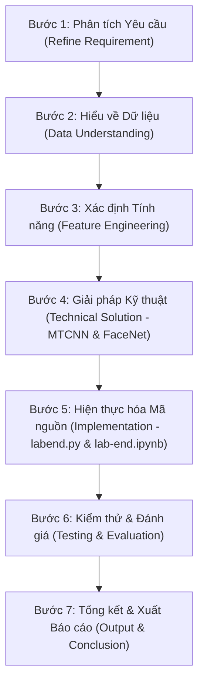

# QUY TRÌNH PHÁT TRIỂN & XỬ LÝ HỆ THỐNG (SYSTEM WORKFLOW)

Quy trình giải quyết bài toán Nhận diện khuôn mặt thời gian thực (Lab-end) tuân thủ mô hình 7 bước tiêu chuẩn trong Xử lý ảnh & AI:

---

## Chi Tiết Các Bước Trực Thuộc:

### Bước 1 - Phân tích yêu cầu (Refine Requirement)
Xác định chính xác bài toán nhận diện thời gian thực qua webcam, các điều kiện ngưỡng phân loại (`Similarity > 0.7` -> "Matched", `Similarity <= 0.7` -> "Unknown"), cũng như kết quả đầu ra mong muốn.

### Bước 2 - Hiểu về dữ liệu (Data Understanding)
Khảo sát cấu trúc ảnh đầu vào từ webcam/ảnh tĩnh (kích thước khung hình, điều kiện ánh sáng, màu sắc BGR/RGB) và chuẩn hóa về dạng tensor phù hợp cho các mô hình AI.

### Bước 3 - Xác định Tính năng (Feature Engineering)
Định nghĩa các tính năng cốt lõi của hệ thống:
- Luồng bắt hình ảnh webcam OpenCV.
- Phát hiện Bounding Box & Landmarks bằng MTCNN.
- Trích xuất 512-dimensional face vector bằng FaceNet.
- Đo khoảng cách tương đồng Cosine Similarity.

### Bước 4 - Giải pháp Kỹ thuật (Technical Solution)
- **Phần Logic**: Xử lý khung hình OpenCV, tính Cosine Similarity, so sánh ngưỡng 0.55 và vẽ khung hiển thị kết quả.
- **Phần AI**:
  - **MTCNN**: Multi-task Cascaded Convolutional Networks cho face detection & alignment.
  - **FaceNet (InceptionResnetV1)**: Deep Neural Network tạo embedding khuôn mặt.

### Bước 5 - Hiện thực hóa (Implementation)
- Đóng gói logic vào class Python `FaceRecognitionSystem` trong `notebook/labend.py`.
- Trình bày toàn bộ luồng xử lý trực quan theo từng bước trong `notebook/lab-end.ipynb`.

### Bước 6 - Kiểm thử và Đánh giá (Testing & Evaluation)
- **Tầng 1 (Đánh giá Mô hình)**: Kiểm tra khả năng sinh embedding khác biệt giữa 2 khuôn mặt khác nhau và tính tương đồng của cùng 1 người.
- **Tầng 2 (Đánh giá Luồng)**: Kiểm thử nhận diện trên webcam trực tiếp với độ mượt khung hình (FPS) và độ chính xác của nhãn Matched/Unknown.

### Bước 7 - Kết luận (Conclusion)
Tổng hợp kết quả thu được, lưu ảnh xuất ra vào `data/output/` và chốt tài liệu hoàn thiện bài lab-end.