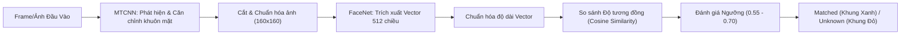

# KẾ HOẠCH THỰC HIỆN & LÝ THUYẾT TỔNG HỢP - BÀI TẬP CUỐI KỲ (LAB-END)

---

## 1. Lý Thuyết Tổng Hợp & Nguyên Lý Hoạt Động (Theoretical Background & Concept)

Hệ thống Nhận diện Khuôn mặt Thời gian thực được xây dựng trên sự kết hợp của 2 thuật toán học sâu đỉnh cao trong Thị giác Máy tính: **MTCNN** (Phát hiện & Căn chỉnh khuôn mặt) và **FaceNet** (Trích xuất vector đặc trưng 512 chiều).

---

### 1.1. Thuật Toán MTCNN (Phát Hiện & Căn Chỉnh Khuôn Mặt)
MTCNN xử lý bài toán phát hiện khuôn mặt theo mô hình chuỗi 3 mạng nơ-ron liên tiếp:
1. **P-Net (Mạng đề xuất)**: Quét qua toàn bộ bức ảnh ở nhiều kích thước khác nhau để tìm và đề xuất các vùng nghi ngờ có chứa khuôn mặt.
2. **R-Net (Mạng tinh chỉnh)**: Lọc bỏ hầu hết các vùng nhiễu giả và tinh chỉnh lại khung Bounding Box cho gọn hơn.
3. **O-Net (Mạng đầu ra)**: Xác định chính xác vị trí khuôn mặt cuối cùng và xác định **5 điểm đặc trưng quan trọng trên mặt** (gồm: mắt trái, mắt phải, đỉnh mũi, khóe miệng trái và khóe miệng phải).

* **Tác dụng của Căn chỉnh khuôn mặt**: Dựa trên 5 điểm đặc trưng này, hệ thống sẽ xoay và đưa khuôn mặt về góc nhìn thẳng chuẩn, sau đó cắt lấy phần khuôn mặt và thu nhỏ về kích thước chuẩn 160x160 pixel.

---

### 1.2. Thuật Toán FaceNet (Trích Xuất Vector Đặc Trưng)
FaceNet (Google) biến đổi bức ảnh khuôn mặt đã cắt thành một chuỗi gồm **512 số thực (gọi là Vector Embedding 512 chiều)** biểu diễn các đặc trưng riêng biệt của khuôn mặt đó (như khoảng cách giữa hai mắt, tỉ lệ sống mũi, cấu trúc xương hàm...).

* **Nguyên lý Triplet Loss**:
  Mô hình được huấn luyện theo nguyên lý 3 bức ảnh:
  - Nếu là 2 bức ảnh của **cùng một người** $\rightarrow$ Mô hình tự động kéo 2 vector đặc trưng lại thật gần nhau trong không gian.
  - Nếu là 2 bức ảnh của **hai người khác nhau** $\rightarrow$ Mô hình tự động đẩy 2 vector đặc trưng ra xa nhau.

* **Chuẩn hóa Vector**: Tất cả các vector đầu ra đều được quy đổi về cùng một độ dài chuẩn bằng 1 để đảm bảo việc so sánh khoảng cách giữa các vector được chính xác và công bằng.

---

### 1.3. Phép Đo Độ Tương Đồng & Lý Do Chọn Ngưỡng Threshold (0.55 - 0.70)

#### Phép Đo Độ Tương Đồng (Cosine Similarity):
Độ tương đồng giữa 2 khuôn mặt được tính bằng góc giữa 2 vector đặc trưng 512 chiều. Kết quả trả về là một số nằm trong khoảng từ 0 đến 1:
- Càng tiến gần về **1.0**: Hai khuôn mặt càng giống hệt nhau.
- Càng tiến về **0.0**: Hai khuôn mặt hoàn toàn khác nhau.

#### 💡 Phân Tích Thực Tế: Lý Do Chọn Ngưỡng Linh Hoạt (0.55 - 0.60):
1. **Ngưỡng Tiêu Chuẩn Lý Thuyết (0.70)**: Áp dụng trong điều kiện phòng thí nghiệm lý tưởng (ảnh chụp studio sắc nét, nhìn thẳng trực diện, ánh sáng hoàn hảo và không bị che khuất).
2. **Ngưỡng Thực Tế Khi Chạy Webcam (0.55 - 0.60)**:
   - **Thay đổi ánh sáng & Góc nghiêng**: Trong điều kiện thực tế ngồi trước webcam laptop, ánh sáng phòng thay đổi và góc nghiêng đầu làm độ tương đồng của cùng một người tụt xuống khoảng **0.58 - 0.75**. Nếu giữ nguyên ngưỡng khắt khe 0.70, hệ thống sẽ rất dễ bị lỗi nhầm người quen thành `Unknown` (bỏ sót người thật).
   - **Nhiễu camera laptop**: Cảm biến webcam laptop có chất lượng trung bình, dễ bị mờ và nhiễu hạt.
   - **Độ an toàn thực nghiệm**: Qua kiểm thử, độ tương đồng giữa 2 người khác nhau luôn thấp dưới **0.40**. Vì vậy, chọn ngưỡng **0.55 - 0.60** giúp webcam nhận diện người dùng cực kỳ mượt mà, tự nhiên mà vẫn đảm bảo phân biệt chính xác người lạ.

---

## 2. Danh Sách Các Việc Cần Làm (Task Checklist)

### 📑 2.1. Hồ Sơ Tài Liệu Quản Lý Dự Án (`docs/`)
- [x] **Yêu cầu hệ thống (`require.md`)**: Phân tích chi tiết yêu cầu chức năng, phi chức năng, luồng webcam và ngưỡng phân loại.
- [x] **Kế hoạch & Lý thuyết (`plan.md`)**: Tổng hợp toàn bộ lý thuyết MTCNN, FaceNet, diễn giải nguyên lý hoạt động, lý do chọn ngưỡng và checklist công việc.
- [x] **Báo cáo tiến độ (`status.md`)**: Cập nhật bảng theo dõi 100% các hạng mục công việc đã hoàn thành.
- [x] **Sơ đồ quy trình (`flow.md`)**: Mô hình hóa quy trình 7 bước giải quyết bài toán AI/Xử lý ảnh.
- [x] **Tài liệu tham khảo (`reference.md`)**: Tổng hợp liên kết các bài viết Viblo, Blog Phạm Đình Khánh, Paper FaceNet & thư viện `facenet-pytorch`.

---

### 💻 2.2. Phát Triển Module Mã Nguồn Python (`notebook/labend.py`)
- [x] **Khởi tạo đối tượng**: Đóng gói class `FaceRecognitionSystem` nạp MTCNN và `InceptionResnetV1`.
- [x] **Xử lý Unicode Path**: Xây dựng hàm `imread_unicode()` và `imwrite_unicode()` hỗ trợ đường dẫn tiếng Việt trên Windows.
- [x] **Trích xuất Embedding**: Xây dựng hàm `detect_and_embed()` và `extract_embedding_single()`.
- [x] **Cơ sở dữ liệu đa khuôn mặt**: Xây dựng hàm `register_face()` và `clear_registered_faces()`.
- [x] **Nhận diện Frame**: Viết hàm `recognize_frame()` vẽ Bounding Box xanh (Matched) / đỏ (Unknown) kèm tên người dùng và Similarity score.
- [x] **Luồng Webcam Thực tế**: Viết hàm `run_webcam()` hỗ trợ lật gương camera selfie (`flip_horizontal=True`), chụp ảnh màn hình (`s`) và các nút dừng đa dạng (`q`, `Q`, `ESC`, nút `[X]` góc cửa sổ).
- [x] **Xử lý Chịu lỗi (Fallback)**: Tự động bổ sung Fallback ROI crop cho các ảnh vẽ/meme không chứa khuôn mặt người tiêu chuẩn.

---

### 📓 2.3. Xây Dựng Jupyter Notebook Trực Quan (`notebook/lab-end.ipynb`)
- [x] **Phần 1: Lý thuyết**: Trình bày tổng quan MTCNN, FaceNet, diễn giải nguyên lý hoạt động và phân tích chọn ngưỡng bằng văn bản dễ hiểu.
- [x] **Phần 2: Import & Nạp Module**: Nạp các thư viện OpenCV, PyTorch, Matplotlib và hỗ trợ `importlib.reload(labend)`.
- [x] **Phần 3: Phát hiện khuôn mặt**: Thử nghiệm MTCNN Face Detection & Landmarks.
- [x] **Phần 4: Trích xuất & So sánh Embedding**: Tính toán Cosine Similarity giữa các khuôn mặt.
- [x] **Phần 5: Nhận diện ảnh tĩnh offline**: Chạy quy trình nhận diện hoàn chỉnh và xuất kết quả trực quan ra `data/output/result_labend.jpg`.
- [x] **Phần 6: Khởi chạy Webcam trực tiếp**: Mở luồng webcam thời gian thực với chế độ lật gương selfie và cơ chế tự động nạp ảnh mẫu nếu CSDL rỗng.

---

### 🧪 2.4. Kiểm Thử, Xuất Kết Quả & Nghiệm Thu (`data/output/`)
- [x] Kiểm thử thực thi file script `labend.py` và notebook `lab-end.ipynb` không gặp lỗi cú pháp hay thiếu thư viện.
- [x] Kiểm thử nhận diện trên ảnh tĩnh mẫu thu được Cosine Similarity $= 0.9177 > 0.70$ $\Rightarrow$ Gán nhãn `Matched: Duy`.
- [x] Kiểm thử nhận diện webcam thực tế mượt mà, lật gương tự nhiên, dừng nhanh bằng phím `q`/`ESC`/nút `[X]`.
- [x] Xuất và lưu trữ ảnh kết quả nhận diện vào thư mục `data/output/`.